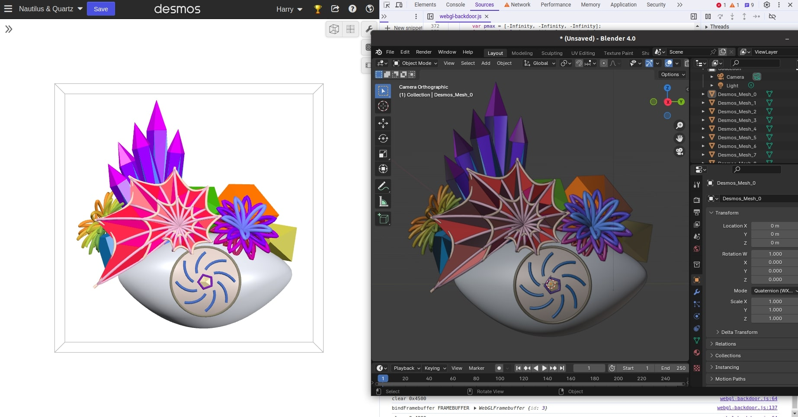

# Desmos to 3D Model

Export graphs created in [Desmos 3D Graphing Calculator](https://www.desmos.com/3d) to 3D models in formats like GLTF, OBJ, and STL that can be used for animation (eg. in Blender) and 3D printing.

## How to use

- Open a 3D Desmos graph
- Turn off slider and ticker animation
- Zoom / Resize window for desired shape and line thickness
- Copy the content of `main-3d.js` and paste into browser JS console
- Once the model re-loads fully, without changing graph viewport, call a function like `downloadGLB()`, `downloadOBJ()`, or `downloadSTL()` to prompt download the 3D model
- Refresh window before viewing/downloading a new graph

## Limitations / To-do

- Support exporting points, spheres, and ellipsoids (which are rendered separately in Desmos)
- Clip mesh parts outside view box (Desmos clips using shader tricks)
- Fix occassional lag/crash
- Fix script when Desmos update breaks it

## How it works

The script creates a wrapper for WebGL that logs 3D model information like geometry and color.
